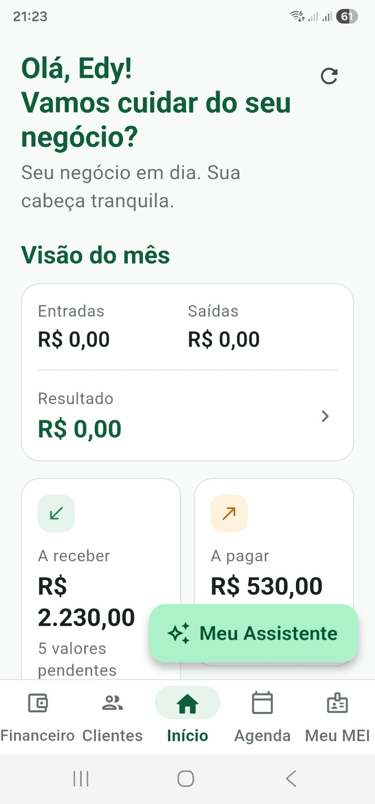
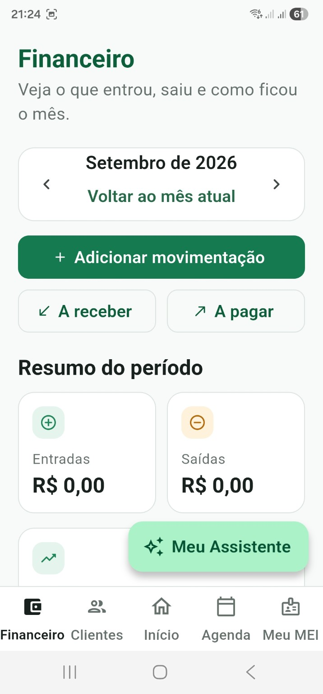
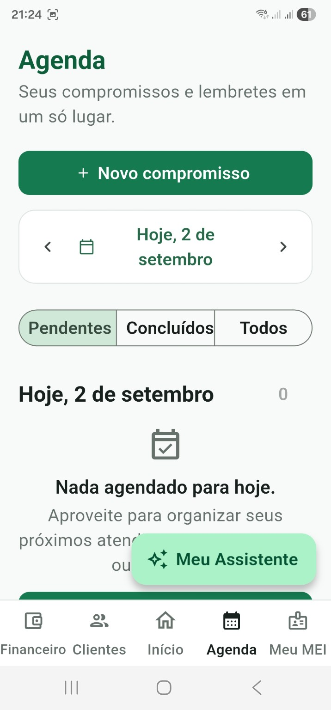
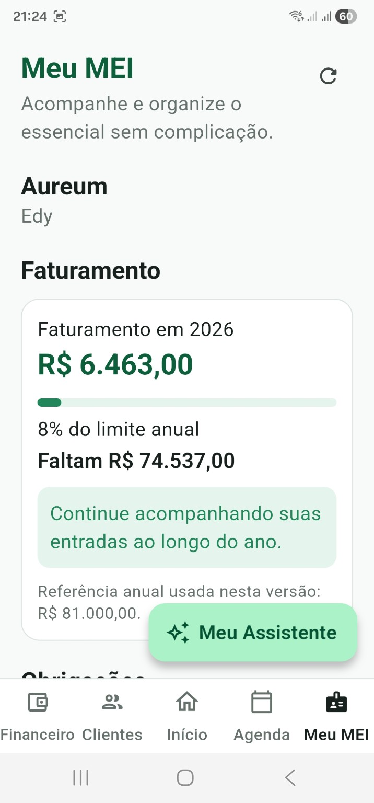
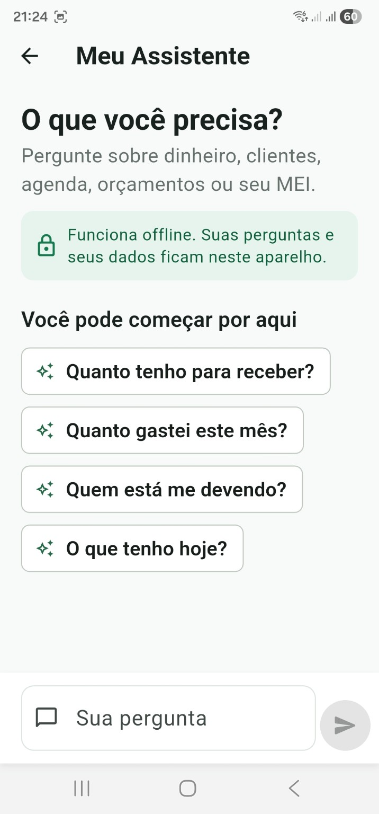

# MEI em Dia

## Visão Geral

O MEI em Dia é um aplicativo de controle e gestão desenvolvido para microempreendedores individuais que trabalham sozinhos e precisam organizar o negócio sem a complexidade de um ERP tradicional.

**"Seu negócio em dia. Sua cabeça tranquila."**

## O Problema

Pequenos MEIs frequentemente precisam controlar entradas e saídas, contas a receber, contas a pagar, clientes, compromissos, orçamentos, faturamento anual e obrigações do MEI — mas normalmente fazem isso usando várias ferramentas, anotações ou planilhas diferentes, sem uma visão unificada do negócio.

## A Solução

O MEI em Dia centraliza essas funções em uma experiência mobile simples, permitindo que o microempreendedor acompanhe a saúde financeira e as pendências do negócio em um único lugar, direto do celular.

## Principais Funcionalidades

- Dashboard / visão do mês
- Controle financeiro
- Entradas e saídas
- Contas a receber
- Contas a pagar
- Cadastro e gestão de clientes
- Agenda
- Orçamentos
- Acompanhamento do faturamento anual do MEI
- Obrigações e organização do MEI
- Meu Assistente
- Funcionamento com dados armazenados localmente no aparelho

O Meu Assistente atualmente consulta e interpreta informações armazenadas localmente no aparelho, sem depender de serviços de IA em nuvem.

## Screenshots

### Visão geral do negócio

Dashboard consolidando informações financeiras e pendências importantes do mês.

### Controle financeiro

Visão do período com entradas, saídas e resumo financeiro.

### Agenda

Compromissos e lembretes organizados por data e status.

### Meu MEI

Acompanhamento do faturamento anual e do limite do MEI.

### Meu Assistente

Assistente que consulta e interpreta os dados armazenados localmente no aparelho.

## Stack Tecnológica

- Flutter
- Dart
- Material 3
- Riverpod
- GoRouter
- Drift
- SQLite
- Git / GitHub

## Arquitetura

O projeto segue uma arquitetura modular, organizada por features, com separação clara entre interface (presentation), lógica de aplicação (controllers/services), domínio (domain) e persistência (data/repositories).

A navegação é centralizada com GoRouter, e a persistência local é feita com Drift sobre SQLite, garantindo tipagem forte nos dados armazenados no aparelho.

## Qualidade

O projeto conta com uma suíte de testes automatizados, incluindo testes unitários (banco de dados, domínio, repositórios) e testes de navegação e fluxo (inicialização do app, navegação principal, rotas secundárias e fluxo de assinatura).

A base de código também utiliza `flutter_lints` com `analysis_options.yaml` configurado, reforçando padronização e qualidade estática do código.

## Meu Papel

Responsável pela concepção do produto, definição de requisitos, arquitetura, validação funcional e desenvolvimento do aplicativo, utilizando ferramentas modernas de desenvolvimento e IA como apoio ao processo de engenharia.

## Status

O aplicativo está em desenvolvimento ativo e em preparação para lançamento. O código-fonte permanece privado por se tratar de um produto comercial.

---

[Voltar ao portfólio](../README.md)
